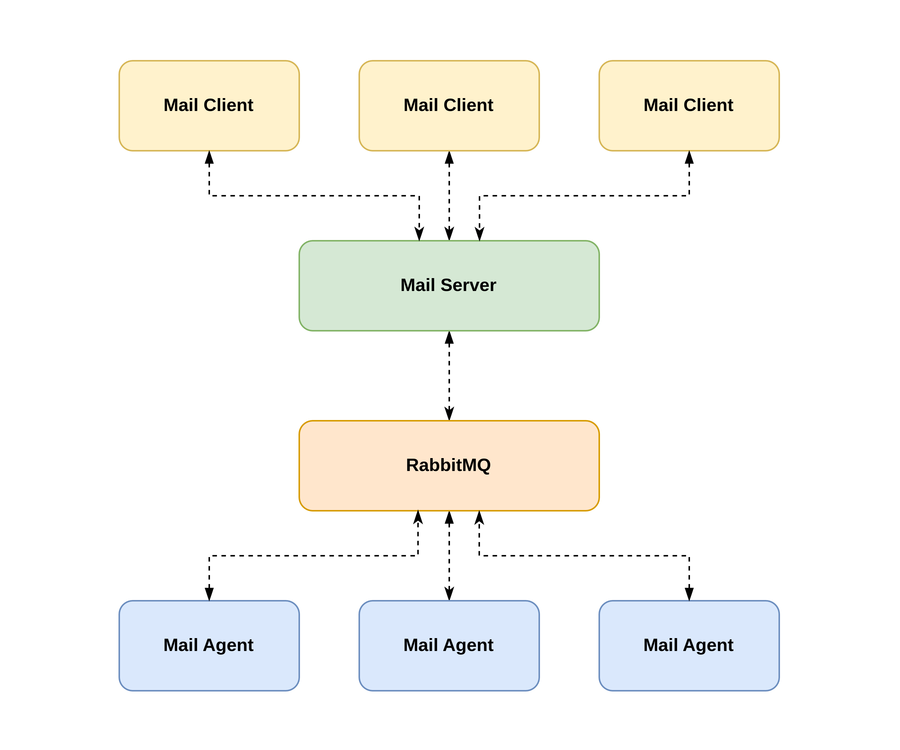

<div align="center">
  
  <h2>Frappe Mail</h2>
</div>

Frappe Mail is an open-source email platform built on the [Frappe Framework](https://github.com/frappe/frappe), designed to streamline end-to-end email management. It’s organized into three core components [Client](https://github.com/frappe/mail_client), [Server](https://github.com/frappe/mail_server), and [Agent](https://github.com/frappe/mail_agent). The Client generates email messages and passes them to the Server for processing. The Server handles essential validations, such as checking user quotas, enforcing limits, and running spam checks. If all checks are cleared, the email is pushed to [RabbitMQ](https://github.com/rabbitmq/rabbitmq-server). The Agent then takes over, with multiple agents available to consume emails from the queue and deliver them through a locally connected Haraka MTA instance. With simple APIs, Frappe Mail makes it easy to integrate reliable email functionality into your applications.

> Note: Frappe Mail Server is designed to work exclusively with the Frappe Mail Client and is not compatible with traditional email clients like Thunderbird.

## Table of Contents

- [Installation](#installation)
- [Mail System Architecture](#mail-system-architecture)
- [Email Sending Process](#email-sending-process)
  - [Email Composition and DKIM Signing](#1-email-composition-and-dkim-signing)
  - [Transferring Emails to the Mail Server](#2-transferring-emails-to-the-mail-server)
  - [Pushing Emails to RabbitMQ](#3-pushing-emails-to-rabbitmq)
  - [Consuming Emails from RabbitMQ](#4-mail-agent-consuming-emails-from-rabbitmq)
  - [Sending the Email](#5-haraka-sending-the-email)
  - [Custom Haraka Plugins for Delivery Status](#6-custom-haraka-plugins-for-delivery-status)
  - [Syncing Delivery Status](#7-syncing-delivery-status)
- [Email Receiving Process](#email-receiving-process)
  - [IP Blacklist Check](#1-ip-blacklist-check)
  - [PTR/RDNS Check](#2-ptrrdns-check)
  - [SPF, DKIM, and DMARC Checks](#3-spf-dkim-and-dmarc-checks)
  - [Queue Handling in RabbitMQ](#4-queue-handling-in-rabbitmq)
  - [Spam Detection](#5-spam-detection)
  - [Asynchronous Recipient Validation](#6-asynchronous-recipient-validation)
  - [Inbox or Spam Folder Routing](#7-inbox-or-spam-folder-routing)
- [Contributing](#contributing)
- [License](#license)

## Installation

You can install this app using the [bench](https://github.com/frappe/bench) CLI:

1. Install Frappe Mail Server:

   ```bash
   bench get-app mail_server
   ```

2. Create a site with the `mail_server` app:

   ```bash
   bench --site sitename.localhost install-app mail_server
   ```

3. Open the site in the browser:

   ```bash
   bench browse sitename.localhost --user Administrator
   ```

## Mail System Architecture

Frappe Mail uses a **modular, event-driven architecture** optimized to handle high volumes of email traffic while decoupling essential email processing tasks. This setup ensures scalability, reliability, and efficient performance across each component of the email workflow.

<div align="center">
  <br/>
  <picture>
    <source media="(prefers-color-scheme: dark)" srcset=".github/architecture-dark.png">
    
  </picture>
  <br/>
  <br/>
</div>

### Components

- **Mail Client:** This component is responsible for generating email messages, either through the user interface, Desk interface, or API. The Client processes each email, including adding a DKIM signature, and prioritizes it before sending it to the Mail Server.

- **Mail Server:** The Mail Server validates the email request by enforcing user quotas, checking domain validity, and applying spam filters. If the email meets all requirements, it is pushed to RabbitMQ for further processing.

- **RabbitMQ:** Acting as the central message broker, RabbitMQ queues emails and manages asynchronous message handling between the Mail Server and Mail Agent(s). This decoupling enables the system to scale and process emails efficiently.

- **Mail Agent:** The Mail Agent retrieves emails from RabbitMQ, delivering each via a locally connected Haraka MTA instance. After sending, it pushes delivery status or events back to RabbitMQ, which are then consumed by the Mail Server to update the email status in the database.

This architecture ensures that the Frappe Mail system remains modular, allowing each component to focus on specific tasks, resulting in a high-performance email platform.

## Email Sending Process

Frappe Mail is designed to manage email delivery through a modular and scalable approach, utilizing components such as the Mail Client, Mail Server, RabbitMQ for message queuing, and Mail Agent with Haraka MTA for SMTP delivery. Here’s a detailed look at each step:

### 1. Email Composition and DKIM Signing

When a user composes an email through the Mail Client:

- **Email Composition:**

  - The Mail Client collects essential information, including the sender’s address, recipients (To, CC, BCC), subject, body, and attachments.
  - The email is structured according to the MIME (Multipurpose Internet Mail Extensions) standard, enabling rich text and attachments.

- **DKIM Signing:**

  - **DomainKeys Identified Mail (DKIM)** is a security protocol that authenticates emails to prevent tampering.
  - A **DKIM signature** is generated by hashing parts of the email (headers and body) and signing with the sender’s **private key** linked to their domain (e.g., frappe.school).
  - This signature is embedded in the email headers. The recipient’s server can verify the message’s integrity using the sender’s **public** key (in DNS records).
  - Example DKIM header:

  ```plaintext
  DKIM-Signature: v=1; a=rsa-sha256; c=relaxed/simple; d=frappe.school; i=@frappe.school; q=dns/txt; s=frappemail;
                  t=1725623282; h=to : cc : from : date : subject : reply-to : message-id : in-reply-to;
                  bh=36NiEgOw7wBe1ybSgQrTNMwH4CVW397O3gYl4I4Ex9c=;
                  b=D694Lhp/Li25ufrneaVUcddrbYq848mAyY0VvKlCkakDEUxiqOX44HxommAkr2eNWSAtB HbkiXq0/jO3F89rpfDRuLCe3AZ8fwuClDniMwYTslZYIO8tlSpAoC7kCfBADArlQFUwVihw FtUaKuSpfJeUaKhmeYQg1CT63BiGOy+gal57ARWVJdMJatod2REguGqRYXu4cAZemaOd0Uz x7VbwW3x0Egn9QfFIcl3uCHZMCQTE4krfWX9ad0h5XK8WkXcGDF/LjSUnrYCb2WiJxqof2/ Jnpm2HfEKYPTm8gAYmSR1uMw17EbYvtGmoD83hc1ZQWaaKB1mFSyqkVBOIfA==
  ```

### 2. Transferring Emails to the Mail Server

After composition and signing, the email is handed to the Mail Server, which handles validation and queueing:

- **Validation Checks:**
  - The Mail Server verifies the sender’s credentials, checks domain and quota compliance, and runs spam checks.
  - If valid, the email is marked as accepted.

### 3. Pushing Emails to RabbitMQ

Depending on email priority (e.g., urgent notifications like password resets are sent immediately), emails are queued in RabbitMQ:

- **Why RabbitMQ?**

  - RabbitMQ manages email queuing asynchronously, preventing system overload and enabling scalable delivery.
  - It decouples composition from delivery, allowing the Mail Server to handle other tasks without delay.

- **Message Queuing:**
  - Each email is formatted into a message with:
    - **Metadata:** Recipient info and a unique **UUID** for tracking.
    - **Message Body:** MIME content with DKIM signature.
  - The message is then queued in **RabbitMQ** for processing.

### 4. Mail Agent: Consuming Emails from RabbitMQ

The **Mail Agent**, consumes queued emails from RabbitMQ and passes them to the **Haraka MTA**:

- **Mail Agent’s Role:**
  - The Mail Agent retrieves email messages from RabbitMQ and prepares them for SMTP delivery.
  - It reads the UUID, recipients, and MIME content.
- **SMTP:**
  - The Mail Agent sends emails to Haraka MTA, which handles the final SMTP transaction.
  - Delivery attempts are logged, and responses from Haraka are forwarded to RabbitMQ for Mail Server processing.

### 5. Haraka: Sending the Email

**Haraka MTA** acts as the outbound mail server, delivering the message to the recipient’s mail server:

- **Delivery Steps:**

  - The email is received by Haraka from the Mail Agent.
  - Haraka processes it with plugins (some customized for Frappe Mail) and attempts delivery.
  - The DKIM header from the Mail Client remains intact, enabling recipient servers to verify authenticity.
  - Haraka ensures SPF and DMARC compliance to reduce spam risk.

- **Custom Plugins:**
  - **Tracking and Response Handling:** Haraka plugins capture delivery responses, such as success, deferral, or bounce, and return these to RabbitMQ.

### 6. Custom Haraka Plugins for Delivery Status

Custom Haraka plugins monitor and relay delivery statuses to the Mail Server via RabbitMQ:

- **Response Types:**

  - **Queued:** The email is prepared for delivery.
  - **Sent:** Delivery confirmed by the recipient server.
  - **Deferred:** Temporary issues with recipient server.
  - **Bounced:** Delivery failure due to recipient errors (e.g., “550 No Such User”).

- **Pushing Status to RabbitMQ:**

  - Plugins send structured status updates, including UUID, recipient address, status code, and error details, back to RabbitMQ.

### 7. Syncing Delivery Status

The Mail Server runs a job to update email statuses based on responses in RabbitMQ:

- **Status Syncing:**

  - A scheduled job in the Mail Server checks for updates and processes them, marking emails as “Sent,” “Deferred,” or “Bounced” as appropriate.
  - Users can track their emails’ statuses through the Mail Client, including success, bounce, and delivery metrics for larger campaigns.

This architecture ensures that emails are efficiently processed, reliably tracked, and promptly delivered with robust monitoring and error handling.

## Email Receiving Process

The Inbound Mail Agent securely receives and processes incoming emails, enforcing multiple layers of validation to maintain integrity, security, and efficient delivery.

### 1. IP Blacklist Check

- **Initial Screening:** As soon as a connection is made, the **Inbound Mail Agent** consults an IP blacklist managed by the **Mail Server**.
- **Immediate Rejection:** If the connecting IP appears on the blacklist, the connection is rejected right away to prevent handling emails from known malicious or untrusted sources.
- **Continued Processing:** Only IPs not found in the blacklist proceed to the next validation step.

### 2. PTR/RDNS Check

- **Reverse DNS Validation:** The agent performs a **PTR (Pointer) or RDNS (Reverse DNS) check** to verify the authenticity of the connecting IP address.
- **Connection Handling:** If the IP lacks a valid PTR record or fails the PTR check, the connection is dropped.
- **Trusted Connections:** Valid PTR records allow the email to proceed to the next stages, supporting the acceptance of emails from recognized servers.

### 3. SPF, DKIM, and DMARC Checks

- **Sender Verification:** Haraka performs essential sender authentication through SPF, DKIM, and DMARC checks to confirm that the email originates from a trusted source:

  - **SPF (Sender Policy Framework)** verifies that the sender’s server is authorized to send on behalf of the claimed domain.
  - **DKIM (DomainKeys Identified Mail)** authenticates the message's integrity with cryptographic signatures.
  - **DMARC** combines SPF and DKIM checks to enhance protection against spoofing and phishing.

- **Metadata Addition:** The results of these checks are included as **email headers**, enabling the Mail Client and Server to use this information for further processing and reporting.

### 4. Queue Handling in RabbitMQ

- **Asynchronous Processing:** After passing initial validations, the email is pushed into a **RabbitMQ queue**.
- **Scheduled Retrieval:** The Mail Server pulls emails from RabbitMQ using scheduled jobs, ensuring that the email handling process does not slow down and can scale effectively with incoming traffic.

### 5. Spam Detection

- **Spam Filtering:** A comprehensive spam check is conducted based on the spam settings configured within the Mail Server.
- **Routing:** The email then sent to the Mail Client via a **webhook** for user access.

### 6. Asynchronous Recipient Validation

- **Recipient Verification:** The system includes asynchronous recipient handling, where it checks if the recipient exists and is active.
- **Status Update:** If the recipient is invalid (such as a non-existent or inactive user), the email is marked as **rejected**.
- **Sender Notification:** Depending on configuration, a **notification** can be sent back to the original sender, informing them that the message could not be delivered.

### 7. Inbox or Spam Folder Routing

- **Final Destination:** Based on the spam score and filtering rules, the email is either placed in the **Inbox** or directed to the **Spam** folder in the user’s mailbox.
- **User Access:** This routing helps users stay organized, enabling quick access to important messages while reducing exposure to potential spam.

## Contributing

This app uses `pre-commit` for code formatting and linting. Please [install pre-commit](https://pre-commit.com/#installation) and enable it for this repository:

```bash
cd apps/mail_server
pre-commit install
```

Pre-commit is configured to use the following tools for checking and formatting your code:

- ruff
- eslint
- prettier
- pyupgrade

## License

[GNU Affero General Public License v3.0](https://github.com/frappe/mail_server/blob/develop/license.txt)
